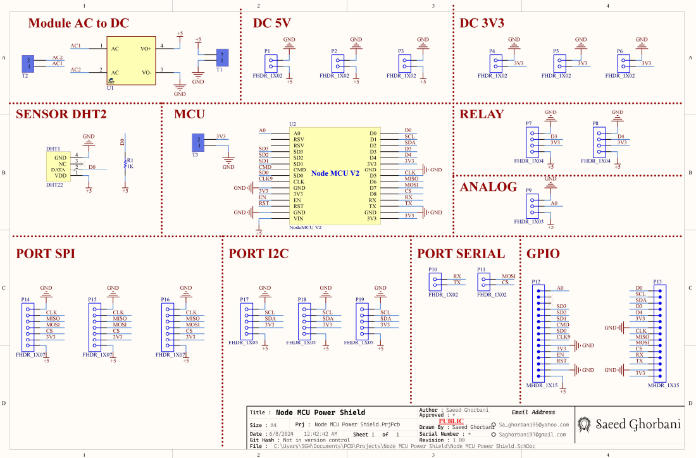
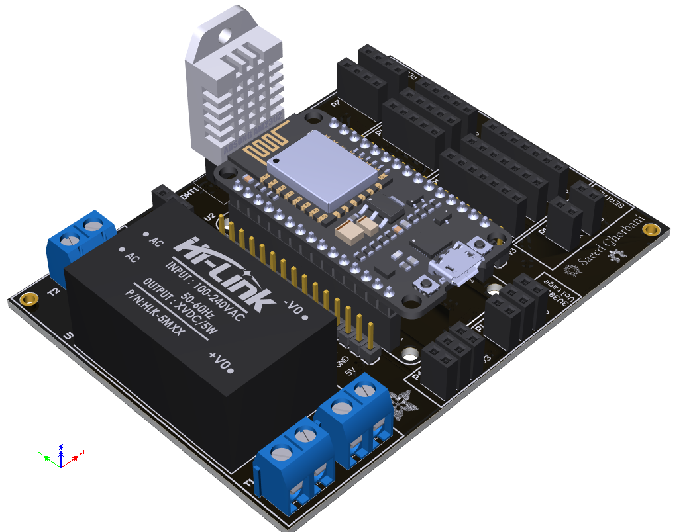
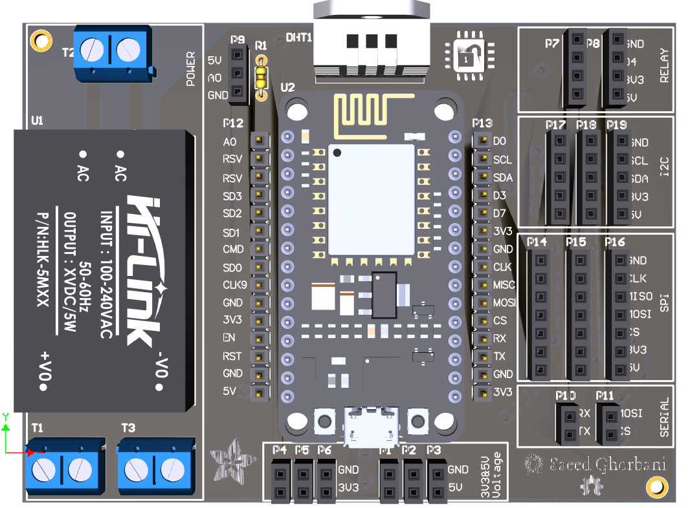

<!DOCTYPE html>
<html lang="en">
<head>
<meta charset="UTF-8">
<meta name="viewport" content="width=device-width, initial-scale=1.0">

</head>
<body>
<h1 class="fadeIn" style="color: #e83e8c">NodeMCU v2 HLK-10M05</h1>

This project is a startup board for the NodeMCU v2 module using the HLK-10M05 5V 10W Hi-Link AC-DC Module. This board is suitable for Internet of Things (IoT) applications.

<h2 class="fadeIn" style="color: #17a2b8">NodeMCU v2</h2>

NodeMCU v2 is an IoT development board based on the ESP8266 module. This board has outstanding features for IoT projects including Wi-Fi, Bluetooth, and Lua microcontroller support. NodeMCU can be easily programmed using various programming languages such as Lua or Arduino IDE.

<h3 class="fadeIn" style="color: #fd7e14">NodeMCU v2 Applications:</h3>

<ul class="fadeIn" style="color: #dc3545">
  <li>Temperature and humidity sensing</li>
  <li>Controlling home appliances</li>
  <li>Camera sensors and imaging</li>
  <li>Energy monitoring and home electronics</li>
  <li>Telecommunications projects and internet connectivity</li>
</ul>

<h4 class="fadeIn" style="color: #6610f2">NodeMCU v2 Specifications:</h4>

<table class="fadeIn" style="color: #6f42c1">
  <tr>
    <th>Specification</th>
    <th>Description</th>
  </tr>
  <tr>
    <td>Version</td>
    <td>v2</td>
  </tr>
  <tr>
    <td>Microcontroller</td>
    <td>ESP8266</td>
  </tr>
  <tr>
    <td>Wi-Fi</td>
    <td>802.11 b/g/n</td>
  </tr>
  <tr>
    <td>Bluetooth</td>
    <td>None</td>
  </tr>
  <tr>
    <td>Input Voltage</td>
    <td>5V DC</td>
  </tr>
  <tr>
    <td>Programming</td>
    <td>Lua, Arduino IDE</td>
  </tr>
  <tr>
    <td>Dimensions</td>
    <td>49 × 24 mm</td>
  </tr>
</table>

<h2 class="fadeIn" style="color: #007bff">HLK-10M05 Power Module</h2>

The HLK-10M05 power module is used to power the NodeMCU v2 due to the following features:

<ul class="fadeIn" style="color: #dc3545">
  <li><strong>High Efficiency</strong>: The HLK-10M05 module utilizes a high-efficiency AC-DC converter and high-quality voltage conversion, providing stable and reliable power supply.</li>
  <li><strong>Compact Size</strong>: This module has a small form factor, easily fitting into projects with limited space.</li>
  <li><strong>High Safety</strong>: Given the safety features of the HLK-10M05 module, powering through this module is suitable for projects requiring high safety.</li>
</ul>

<h3 class="fadeIn" style="color: #fd7e14">HLK-10M05 Power Module Specifications:</h3>

<table class="fadeIn" style="color: #6f42c1">
  <tr>
    <th>Specification</th>
    <th>Description</th>
  </tr>
  <tr>
    <td>Input</td>
    <td>AC Voltage 85 to 265V</td>
  </tr>
  <tr>
    <td>Output</td>
    <td>5V DC Fixed Voltage with 10W Power</td>
  </tr>
  <tr>
    <td>Output Voltage</td>
    <td>5V DC</td>
  </tr>
  <tr>
    <td>Output Current</td>
    <td>2A</td>
  </tr>
  <tr>
    <td>Dimensions</td>
    <td>34 × 20 × 15 mm</td>
  </tr>
  <tr>
    <td>Weight</td>
    <td>Approximately 15g</td>
  </tr>
</table>

<h2 class="fadeIn" style="color: #007bff">Circuit Schematic and PCB 3D Images</h2>

Here are the circuit schematic and PCB 3D images of the NodeMCU v2 with power from the HLK-10M05 module:

<h3 class="fadeIn" style="color: #fd7e14">Circuit Schematic</h3>

<h3 class="fadeIn" style="color: #fd7e14">PCB 3D Images</h3>

<h2 class="fadeIn" style="color: #007bff">Installation and Setup</h2>

<ol class="fadeIn" style="color: #6610f2">
  <li><strong>Transfer Files</strong>: Transfer the circuit design files from the GitHub repository to your computer.</li>
  <li><strong>Board Assembly</strong>: Connect the NodeMCU v2 module and the HLK-10M05 power module to the printed circuit board (PCB). Ensure the connections are properly made and there are no short circuits.</li>
  <li><strong>Describe the Design</strong>: Detailed descriptions and circuit diagrams are available in the design files. Please review them.</li>
  <li><strong>NodeMCU Programming</strong>: Install the necessary programs for NodeMCU and upload your desired code to it.</li>
  <li><strong>Getting Started</strong>: After programming NodeMCU, connect the board to a power source and run the program.</li>
</ol>

<h2 class="fadeIn" style="color: #007bff">Requirements</h2>

<ul class="fadeIn" style="color: #dc3545">
  <li>NodeMCU v2</li>
  <li>HLK-10M05 power module</li>
  <li>USB cable for NodeMCU programming</li>
  <li>Connecting wires</li>
</ul>

<h2 class="fadeIn" style="color: #007bff">Directory Structure</h2>

<pre class="fadeIn" style="color: #6f42c1">
📦 Node MCU Power Shield
 ┣ 📂 Documents
 ┃ ┗ 📜 Node MCU Power Shield.pdf
 ┃ ┗ 📜 Shematic.pdf

 ┣ 📂 Images
 ┃ ┣ 📂 schematic
 ┃ ┃ ┗ 📜 schematic.png
 ┃ ┗ 📂 pcb
 ┃   ┗ 📜 3d.png
 ┃   ┗ 📜 3d_TOP.png

 ┣ 📂 Design
 ┃ ┗ 📜 Node MCU Power Shield.PrjPcb
 ┃ ┗ 📜 Node MCU Power Shield.PcbDoc
 ┃ ┗ 📜 Node MCU Power Shield.SchDoc

 ┣ 📜 LICENSE
 ┣ 📜 README.md
 ┗ 📜 .gitignore
</pre>

This directory structure and file organization help users easily find hardware and software-related files and get familiar with the project.

<h2 class="fadeIn" style="color: #007bff">Contribution and License</h2>

<h3 class="fadeIn" style="color: #28a745">Contribution</h3>

Contributions are welcome! Here's how you can contribute to the project:

<ol class="fadeIn" style="color: #17a2b8">
  <li>Fork the repository.</li>
  <li>Create a new branch for your feature (git checkout -b feature/YourFeatureName).</li>
  <li>Commit your changes (git commit -m 'Add some feature').</li>
  <li>Push to the branch (git push origin feature/YourFeatureName).</li>
  <li>Create a new Pull Request.</li>
</ol>

<h3 class="fadeIn" style="color: #fd7e14">License</h3>

This project is licensed under the MIT License - see the <a href="LICENSE" style="color: #007bff">LICENSE</a> file for details.

</body>
</html>
